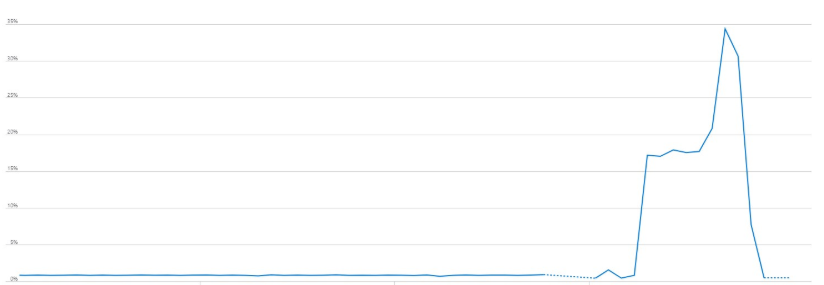

### Escuela Colombiana de Ingeniería
### Arquitecturas de Software - ARSW

## Escalamiento en Azure con Maquinas Virtuales, Sacale Sets y Service Plans

### Dependencias
* Cree una cuenta gratuita dentro de Azure. Para hacerlo puede guiarse de esta [documentación](https://azure.microsoft.com/en-us/free/search/?&ef_id=Cj0KCQiA2ITuBRDkARIsAMK9Q7MuvuTqIfK15LWfaM7bLL_QsBbC5XhJJezUbcfx-qAnfPjH568chTMaAkAsEALw_wcB:G:s&OCID=AID2000068_SEM_alOkB9ZE&MarinID=alOkB9ZE_368060503322_%2Bazure_b_c__79187603991_kwd-23159435208&lnkd=Google_Azure_Brand&dclid=CjgKEAiA2ITuBRDchty8lqPlzS4SJAC3x4k1mAxU7XNhWdOSESfffUnMNjLWcAIuikQnj3C4U8xRG_D_BwE). Al hacerlo usted contará con $200 USD para gastar durante 1 mes.

### Parte 0 - Entendiendo el escenario de calidad

Adjunto a este laboratorio usted podrá encontrar una aplicación totalmente desarrollada que tiene como objetivo calcular el enésimo valor de la secuencia de Fibonnaci.

**Escalabilidad**
Cuando un conjunto de usuarios consulta un enésimo número (superior a 1000000) de la secuencia de Fibonacci de forma concurrente y el sistema se encuentra bajo condiciones normales de operación, todas las peticiones deben ser respondidas y el consumo de CPU del sistema no puede superar el 70%.

### Parte 1 - Escalabilidad vertical

1. Diríjase a el [Portal de Azure](https://portal.azure.com/) y a continuación cree una maquina virtual con las características básicas descritas en la imágen 1 y que corresponden a las siguientes:
    * Resource Group = SCALABILITY_LAB
    * Virtual machine name = VERTICAL-SCALABILITY
    * Image = Ubuntu Server 
    * Size = Standard B1ls
    * Username = scalability_lab
    * SSH publi key = Su llave ssh publica


2. Para conectarse a la VM use el siguiente comando, donde las `x` las debe remplazar por la IP de su propia VM.

    `ssh scalability_lab@xxx.xxx.xxx.xxx`

3. Instale node, para ello siga la sección *Installing Node.js and npm using NVM* que encontrará en este [enlace](https://linuxize.com/post/how-to-install-node-js-on-ubuntu-18.04/).
4. Para instalar la aplicación adjunta al Laboratorio, suba la carpeta `FibonacciApp` a un repositorio al cual tenga acceso y ejecute estos comandos dentro de la VM:

    `git clone <your_repo>`

    `cd <your_repo>/FibonacciApp`

    `npm install`

5. Para ejecutar la aplicación puede usar el comando `npm FibinacciApp.js`, sin embargo una vez pierda la conexión ssh la aplicación dejará de funcionar. Para evitar ese compartamiento usaremos *forever*. Ejecute los siguientes comando dentro de la VM.

    `npm install forever -g`

    `forever start FibinacciApp.js`

6. Antes de verificar si el endpoint funciona, en Azure vaya a la sección de *Networking* y cree una *Inbound port rule* tal como se muestra en la imágen. Para verificar que la aplicación funciona, use un browser y user el endpoint `http://xxx.xxx.xxx.xxx:3000/fibonacci/6`. La respuesta debe ser `The answer is 8`.


7. La función que calcula en enésimo número de la secuencia de Fibonacci está muy mal construido y consume bastante CPU para obtener la respuesta. Usando la consola del Browser documente los tiempos de respuesta para dicho endpoint usando los siguintes valores:

    * 1000000

    

    * 1010000

    

    * 1020000

    


    * 1030000

    

    * 1040000

    

    * 1050000

    


    * 1060000

    

    * 1070000

    

    * 1080000

    

    * 1090000    

    


8. Dírijase ahora a Azure y verifique el consumo de CPU para la VM. (Los resultados pueden tardar 5 minutos en aparecer).


9. Ahora usaremos Postman para simular una carga concurrente a nuestro sistema. Siga estos pasos.
    * Instale newman con el comando `npm install newman -g`. Para conocer más de Newman consulte el siguiente [enlace](https://learning.getpostman.com/docs/postman/collection-runs/command-line-integration-with-newman/).
    * Diríjase hasta la ruta `FibonacciApp/postman` en una maquina diferente a la VM.
    * Para el archivo `[ARSW_LOAD-BALANCING_AZURE].postman_environment.json` cambie el valor del parámetro `VM1` para que coincida con la IP de su VM.

    

    * Ejecute el siguiente comando.

    ```
    newman run ARSW_LOAD-BALANCING_AZURE.postman_collection.json -e [ARSW_LOAD-BALANCING_AZURE].postman_environment.json -n 10 &
    newman run ARSW_LOAD-BALANCING_AZURE.postman_collection.json -e [ARSW_LOAD-BALANCING_AZURE].postman_environment.json -n 10
    ```

    


10. La cantidad de CPU consumida es bastante grande y un conjunto considerable de peticiones concurrentes pueden hacer fallar nuestro servicio. Para solucionarlo usaremos una estrategia de Escalamiento Vertical. En Azure diríjase a la sección *size* y a continuación seleccione el tamaño `B2ms`.


11. Una vez el cambio se vea reflejado, repita el paso 7, 8 y 9.

    * Paso 7 
    
    * 1000000

    

    * 1010000

    

    * 1020000

    


    * 1030000

    

    * 1040000

    

    * 1050000

    


    * 1060000

    

    * 1070000

    

    * 1080000

    

    * 1090000    

    

    * Paso 8

    

    * Paso 9

    

    
12. Evalue el escenario de calidad asociado al requerimiento no funcional de escalabilidad y concluya si usando este modelo de escalabilidad logramos cumplirlo.
13. Vuelva a dejar la VM en el tamaño inicial para evitar cobros adicionales.

**Preguntas**

1. ¿Cuántos y cuáles recursos crea Azure junto con la VM?

    * Azure crea 6 recursos adicionales a la VM: Cuenta de almacenamiento, disco, grupo de seguridad de red, direccion IP publica,interfaz de red. Red virtual

2. ¿Brevemente describa para qué sirve cada recurso?

        * Cuenta de almacenamiento: Almacena datos en un disco virtual.        
        * Disco:Es la version virtualizada de la maquina que creamos, guarda el sistema operativo y otros componentes.
        * Grupo de seguridad de red: Filtra el trafico de la red de la maquina.
        * Direccion IP publica: Permite saber cuál es la dirección IP que se usa para la conexión saliente
        * Interfaz de red: Permite a la maquina virtual comunicarse con recursos en internet.
        * Red virtual: Red por donde opera la interfaz de red.

3. ¿Al cerrar la conexión ssh con la VM, por qué se cae la aplicación que ejecutamos con el comando `npm FibonacciApp.js`? ¿Por qué debemos crear un *Inbound port rule* antes de acceder al servicio?

        * Porque al cerrar la conexion ssh ya no hay conexion con la maquina virtual, es necesario abrir un puerto por donde pueda ser accesible todo el tiempo.
        
4. Adjunte tabla de tiempos e interprete por qué la función tarda tando tiempo.

    

    * Los tiempos estan fundamentados en la mala implementación de la solución, que resuelve la formula paso a paso.

5. Adjunte imágen del consumo de CPU de la VM e interprete por qué la función consume esa cantidad de CPU.

    

    * La cantidad de CPU consumida representa las bajas condiciones con las que se creo la maquina virtual.

6. Adjunte la imagen del resumen de la ejecución de Postman. Interprete:

    

    


    * Tiempos de ejecución de cada petición.

    * Los tiempos de ejecucion de cada una de las peticiones es muy similar , esto se pued evidenciar en los graficos mostrados previamente 

    * Si hubo fallos documentelos y explique.

    
7. ¿Cuál es la diferencia entre los tamaños `B2ms` y `B1ls` (no solo busque especificaciones de infraestructura)?

    *  B1ls tiene: 1 vCPU, 0.5 GB de RAM, 2 discos de datos, 160 E/S, 4 GB de almacenamiento temporal

    * B2ms tiene: 2 vCPU, 8 GB de RAM, 4 discos de datos, 1920 E/S, 16 GB de almacenamiento temporal

8. ¿Aumentar el tamaño de la VM es una buena solución en este escenario?, ¿Qué pasa con la FibonacciApp cuando cambiamos el tamaño de la VM?

    * No es una buena solución, los tiempos de respuesta del programa no muestran una mejora significativa respeacto a la maquina base.  

9. ¿Qué pasa con la infraestructura cuando cambia el tamaño de la VM? ¿Qué efectos negativos implica?

    * Hubo una reducción en el consumo de la CPU gracias a las mejores condiciones de la maquina, pero esto traera consigo un aumento en los gatos injustificados  
    
10. ¿Hubo mejora en el consumo de CPU o en los tiempos de respuesta? Si/No ¿Por qué?

    * Sí, la visualizacion en el consumo de la CPU es mejor debido a la mayor capacidad de procesamiento de la maquina b2ms, pero los tiempos no mejoraron gracias a que estos dependen de la ejecución secuencial del programa mas no de la maquina.

11. Aumente la cantidad de ejecuciones paralelas del comando de postman a `4`. ¿El comportamiento del sistema es porcentualmente mejor?

    * El comportamiento del sistema sigue siendo el mismo 


### Parte 2 - Escalabilidad horizontal

#### Crear el Balanceador de Carga

Antes de continuar puede eliminar el grupo de recursos anterior para evitar gastos adicionales y realizar la actividad en un grupo de recursos totalmente limpio.

1. El Balanceador de Carga es un recurso fundamental para habilitar la escalabilidad horizontal de nuestro sistema, por eso en este paso cree un balanceador de carga dentro de Azure tal cual como se muestra en la imágen adjunta.


2. A continuación cree un *Backend Pool*, guiese con la siguiente imágen.


3. A continuación cree un *Health Probe*, guiese con la siguiente imágen.


4. A continuación cree un *Load Balancing Rule*, guiese con la siguiente imágen.


5. Cree una *Virtual Network* dentro del grupo de recursos, guiese con la siguiente imágen.


#### Crear las maquinas virtuales (Nodos)

Ahora vamos a crear 3 VMs (VM1, VM2 y VM3) con direcciones IP públicas standar en 3 diferentes zonas de disponibilidad. Después las agregaremos al balanceador de carga.

1. En la configuración básica de la VM guíese por la siguiente imágen. Es importante que se fije en la "Avaiability Zone", donde la VM1 será 1, la VM2 será 2 y la VM3 será 3.


2. En la configuración de networking, verifique que se ha seleccionado la *Virtual Network*  y la *Subnet* creadas anteriormente. Adicionalmente asigne una IP pública y no olvide habilitar la redundancia de zona.


3. Para el Network Security Group seleccione "avanzado" y realice la siguiente configuración. No olvide crear un *Inbound Rule*, en el cual habilite el tráfico por el puerto 3000. Cuando cree la VM2 y la VM3, no necesita volver a crear el *Network Security Group*, sino que puede seleccionar el anteriormente creado.


4. Ahora asignaremos esta VM a nuestro balanceador de carga, para ello siga la configuración de la siguiente imágen.


5. Finalmente debemos instalar la aplicación de Fibonacci en la VM. para ello puede ejecutar el conjunto de los siguientes comandos, cambiando el nombre de la VM por el correcto

```
git clone https://github.com/daprieto1/ARSW_LOAD-BALANCING_AZURE.git

curl -o- https://raw.githubusercontent.com/creationix/nvm/v0.34.0/install.sh | bash
source /home/vm1/.bashrc
nvm install node

cd ARSW_LOAD-BALANCING_AZURE/FibonacciApp
npm install

npm install forever -g
forever start FibonacciApp.js
```

Realice este proceso para las 3 VMs, por ahora lo haremos a mano una por una, sin embargo es importante que usted sepa que existen herramientas para aumatizar este proceso, entre ellas encontramos Azure Resource Manager, OsDisk Images, Terraform con Vagrant y Paker, Puppet, Ansible entre otras.

#### Probar el resultado final de nuestra infraestructura

1. Porsupuesto el endpoint de acceso a nuestro sistema será la IP pública del balanceador de carga, primero verifiquemos que los servicios básicos están funcionando, consuma los siguientes recursos:

```
http://52.155.223.248/
http://52.155.223.248/fibonacci/1
```

**Solucion:**


2.Realice las pruebas de carga con `newman` que se realizaron en la parte 1 y haga un informe comparativo donde contraste: tiempos de respuesta, cantidad de peticiones respondidas con éxito, costos de las 2 infraestrucruras, es decir, la que desarrollamos con balanceo de carga horizontal y la que se hizo con una maquina virtual escalada.


3. Agregue una 4 maquina virtual y realice las pruebas de newman, pero esta vez no lance 2 peticiones en paralelo, sino que incrementelo a 4. Haga un informe donde presente el comportamiento de la CPU de las 4 VM y explique porque la tasa de éxito de las peticiones aumento con este estilo de escalabilidad.

```
newman run ARSW_LOAD-BALANCING_AZURE.postman_collection.json -e [ARSW_LOAD-BALANCING_AZURE].postman_environment.json -n 10 &
newman run ARSW_LOAD-BALANCING_AZURE.postman_collection.json -e [ARSW_LOAD-BALANCING_AZURE].postman_environment.json -n 10 &
newman run ARSW_LOAD-BALANCING_AZURE.postman_collection.json -e [ARSW_LOAD-BALANCING_AZURE].postman_environment.json -n 10 &
newman run ARSW_LOAD-BALANCING_AZURE.postman_collection.json -e [ARSW_LOAD-BALANCING_AZURE].postman_environment.json -n 10
```

**Maquina virtual 1**


**Maquina virtual 2 **    


**Maquina virtual 3**


**Ejecucion newman**


**Preguntas**

* ¿Cuáles son los tipos de balanceadores de carga en Azure y en qué se diferencian?, ¿Qué es SKU, qué tipos hay y en qué se diferencian?, ¿Por qué el balanceador de carga necesita una IP pública?
* ¿Cuál es el propósito del *Backend Pool*?
Hace referencia al conjunto de maquinas virtuales que se encargan de responder a las peticiones de los usuarios.
* ¿Cuál es el propósito del *Health Probe*?

Son un conjunto de puebas que le permite conocer al balanceador los recursos y la proximidad para lograr responder lo mas eficientemente posible a una solicitud.

* ¿Cuál es el propósito de la *Load Balancing Rule*? ¿Qué tipos de sesión persistente existen, por qué esto es importante y cómo puede afectar la escalabilidad del sistema?.

Este sirve de mecanismo que le dice al balanceador por que uerto va a consultar a los nodos, y el por que puerto va a ofrecer el servicio.p
* ¿Qué es una *Virtual Network*? ¿Qué es una *Subnet*? ¿Para qué sirven los *address space* y *address range*

Permite conectar los recursos mediante una red privada.

**Virtual network:** Hace referencia a crear una red privada mediante la cual un conjunto de maquinas virtuales se encuentran vinculadas.
**Subnet:** Conjunto de redes que se pueden crear a partir de un conjunto de ips dadas.

**Address space:** La direccion de la red que se desea crear

**Address Range:** El conjunto de direcciones con las que cuenta una red.


* ¿Qué son las *Availability Zone* y por qué seleccionamos 3 diferentes zonas?. ¿Qué significa que una IP sea *zone-redundant*

Cada zona de disponibilidad hace referencia a una ubicacion geograficas, asi que creamos tres diferentes por que azure nos ofrece mediante estas zonas separadas para evitar problemas de disponibilidad?


* cual es el pproposito del *Network Security Group*

El objetivo de los grupos de redes de seguridad es permitir la administracion de puertos, delimitar el trafico que de internet que se da hacia nuestra maquina virtual.?

* Informe de newman 1 (Punto 2)


Se ve claramente una mejora en los tiempos de respuesta entre la prueba del parte 1 a la misma en el parte 2 debido a que fue de 1 minuto 43.9 segundos a simplemente 22 segundos de tiempo de respuesta al igual que el tiempo de ejecucion de ambos se vio considerablemente alterado, con una diferencia 81.9 segundos es aproximadamente con el balanceador de carga un minuto mas rapido en responder a las peticiones.p
* Presente el Diagrama de Despliegue de la solución.


## Bibliografia


[https://docs.microsoft.com/en-us/azure/frontdoor/front-door-backend-pool](https://docs.microsoft.com/en-us/azure/frontdoor/front-door-backend-pool)
)
[https://docs.microsoft.com/es-es/azure/traffic-manager/traffic-manager-load-balancing-azure](https://docs.microsoft.com/es-es/azure/traffic-manager/traffic-manager-load-balancing-azure)


[https://github.com/MicrosoftDocs/azure-docs.es-es/blob/master/articles/availability-zones/az-overview.md](https://github.com/MicrosoftDocs/azure-docs.es-es/blob/master/articles/availability-zones/az-overview.md)
=======
### Escuela Colombiana de Ingeniería
### Arquitecturas de Software - ARSW

## Escalamiento en Azure con Maquinas Virtuales, Sacale Sets y Service Plans

### Dependencias
* Cree una cuenta gratuita dentro de Azure. Para hacerlo puede guiarse de esta [documentación](https://azure.microsoft.com/en-us/free/search/?&ef_id=Cj0KCQiA2ITuBRDkARIsAMK9Q7MuvuTqIfK15LWfaM7bLL_QsBbC5XhJJezUbcfx-qAnfPjH568chTMaAkAsEALw_wcB:G:s&OCID=AID2000068_SEM_alOkB9ZE&MarinID=alOkB9ZE_368060503322_%2Bazure_b_c__79187603991_kwd-23159435208&lnkd=Google_Azure_Brand&dclid=CjgKEAiA2ITuBRDchty8lqPlzS4SJAC3x4k1mAxU7XNhWdOSESfffUnMNjLWcAIuikQnj3C4U8xRG_D_BwE). Al hacerlo usted contará con $200 USD para gastar durante 1 mes.

### Parte 0 - Entendiendo el escenario de calidad

Adjunto a este laboratorio usted podrá encontrar una aplicación totalmente desarrollada que tiene como objetivo calcular el enésimo valor de la secuencia de Fibonnaci.

**Escalabilidad**
Cuando un conjunto de usuarios consulta un enésimo número (superior a 1000000) de la secuencia de Fibonacci de forma concurrente y el sistema se encuentra bajo condiciones normales de operación, todas las peticiones deben ser respondidas y el consumo de CPU del sistema no puede superar el 70%.

### Parte 1 - Escalabilidad vertical

1. Diríjase a el [Portal de Azure](https://portal.azure.com/) y a continuación cree una maquina virtual con las características básicas descritas en la imágen 1 y que corresponden a las siguientes:
    * Resource Group = SCALABILITY_LAB
    * Virtual machine name = VERTICAL-SCALABILITY
    * Image = Ubuntu Server 
    * Size = Standard B1ls
    * Username = scalability_lab
    * SSH publi key = Su llave ssh publica


2. Para conectarse a la VM use el siguiente comando, donde las `x` las debe remplazar por la IP de su propia VM.

    `ssh scalability_lab@xxx.xxx.xxx.xxx`

3. Instale node, para ello siga la sección *Installing Node.js and npm using NVM* que encontrará en este [enlace](https://linuxize.com/post/how-to-install-node-js-on-ubuntu-18.04/).
4. Para instalar la aplicación adjunta al Laboratorio, suba la carpeta `FibonacciApp` a un repositorio al cual tenga acceso y ejecute estos comandos dentro de la VM:

    `git clone <your_repo>`

    `cd <your_repo>/FibonacciApp`

    `npm install`

5. Para ejecutar la aplicación puede usar el comando `npm FibinacciApp.js`, sin embargo una vez pierda la conexión ssh la aplicación dejará de funcionar. Para evitar ese compartamiento usaremos *forever*. Ejecute los siguientes comando dentro de la VM.

    `npm install forever -g`

    `forever start FibinacciApp.js`

6. Antes de verificar si el endpoint funciona, en Azure vaya a la sección de *Networking* y cree una *Inbound port rule* tal como se muestra en la imágen. Para verificar que la aplicación funciona, use un browser y user el endpoint `http://xxx.xxx.xxx.xxx:3000/fibonacci/6`. La respuesta debe ser `The answer is 8`.


7. La función que calcula en enésimo número de la secuencia de Fibonacci está muy mal construido y consume bastante CPU para obtener la respuesta. Usando la consola del Browser documente los tiempos de respuesta para dicho endpoint usando los siguintes valores:

    * 1000000

    

    * 1010000

    

    * 1020000

    


    * 1030000

    

    * 1040000

    

    * 1050000

    


    * 1060000

    

    * 1070000

    

    * 1080000

    

    * 1090000    

    


8. Dírijase ahora a Azure y verifique el consumo de CPU para la VM. (Los resultados pueden tardar 5 minutos en aparecer).


9. Ahora usaremos Postman para simular una carga concurrente a nuestro sistema. Siga estos pasos.
    * Instale newman con el comando `npm install newman -g`. Para conocer más de Newman consulte el siguiente [enlace](https://learning.getpostman.com/docs/postman/collection-runs/command-line-integration-with-newman/).
    * Diríjase hasta la ruta `FibonacciApp/postman` en una maquina diferente a la VM.
    * Para el archivo `[ARSW_LOAD-BALANCING_AZURE].postman_environment.json` cambie el valor del parámetro `VM1` para que coincida con la IP de su VM.

    

    * Ejecute el siguiente comando.

    ```
    newman run ARSW_LOAD-BALANCING_AZURE.postman_collection.json -e [ARSW_LOAD-BALANCING_AZURE].postman_environment.json -n 10 &
    newman run ARSW_LOAD-BALANCING_AZURE.postman_collection.json -e [ARSW_LOAD-BALANCING_AZURE].postman_environment.json -n 10
    ```


    
    
10. La cantidad de CPU consumida es bastante grande y un conjunto considerable de peticiones concurrentes pueden hacer fallar nuestro servicio. Para solucionarlo usaremos una estrategia de Escalamiento Vertical. En Azure diríjase a la sección *size* y a continuación seleccione el tamaño `B2ms`.


11. Una vez el cambio se vea reflejado, repita el paso 7, 8 y 9.

    * Paso 7 
    
    * 1000000

    

    * 1010000

    

    * 1020000

    


    * 1030000

    

    * 1040000

    

    * 1050000

    


    * 1060000

    

    * 1070000

    

    * 1080000

    

    * 1090000    

    

    * Paso 8

    [](imgFuncionamiento/reppas9.PNG)

    * Paso 9

    

    
12. Evalue el escenario de calidad asociado al requerimiento no funcional de escalabilidad y concluya si usando este modelo de escalabilidad logramos cumplirlo.
13. Vuelva a dejar la VM en el tamaño inicial para evitar cobros adicionales.

**Preguntas**

1. ¿Cuántos y cuáles recursos crea Azure junto con la VM?

    * Azure crea 6 recursos adicionales a la VM: Cuenta de almacenamiento, disco, grupo de seguridad de red, direccion IP publica,interfaz de red. Red virtual

2. ¿Brevemente describa para qué sirve cada recurso?

        * Cuenta de almacenamiento: Almacena datos en un disco virtual.        
        * Disco:Es la version virtualizada de la maquina que creamos, guarda el sistema operativo y otros componentes.
        * Grupo de seguridad de red: Filtra el trafico de la red de la maquina.
        * Direccion IP publica: Permite saber cuál es la dirección IP que se usa para la conexión saliente
        * Interfaz de red: Permite a la maquina virtual comunicarse con recursos en internet.
        * Red virtual: Red por donde opera la interfaz de red.

3. ¿Al cerrar la conexión ssh con la VM, por qué se cae la aplicación que ejecutamos con el comando `npm FibonacciApp.js`? ¿Por qué debemos crear un *Inbound port rule* antes de acceder al servicio?

        * Porque al cerrar la conexion ssh ya no hay conexion con la maquina virtual, es necesario abrir un puerto por donde pueda ser accesible todo el tiempo.
        
4. Adjunte tabla de tiempos e interprete por qué la función tarda tando tiempo.

    

    * Los tiempos estan fundamentados en la mala implementación de la solución, que resuelve la formula paso a paso.

5. Adjunte imágen del consumo de CPU de la VM e interprete por qué la función consume esa cantidad de CPU.

    

    * La cantidad de CPU consumida representa las bajas condiciones con las que se creo la maquina virtual.

6. Adjunte la imagen del resumen de la ejecución de Postman. Interprete:

    

    


    * Tiempos de ejecución de cada petición.

    * Los tiempos de ejecucion de cada una de las peticiones es muy similar , esto se pued evidenciar en los graficos mostrados previamente 

    * Si hubo fallos documentelos y explique.

    
7. ¿Cuál es la diferencia entre los tamaños `B2ms` y `B1ls` (no solo busque especificaciones de infraestructura)?

    *  B1ls tiene: 1 vCPU, 0.5 GB de RAM, 2 discos de datos, 160 E/S, 4 GB de almacenamiento temporal

    * B2ms tiene: 2 vCPU, 8 GB de RAM, 4 discos de datos, 1920 E/S, 16 GB de almacenamiento temporal

8. ¿Aumentar el tamaño de la VM es una buena solución en este escenario?, ¿Qué pasa con la FibonacciApp cuando cambiamos el tamaño de la VM?

    * No es una buena solución, los tiempos de respuesta del programa no muestran una mejora significativa respeacto a la maquina base.  

9. ¿Qué pasa con la infraestructura cuando cambia el tamaño de la VM? ¿Qué efectos negativos implica?

    * Hubo una reducción en el consumo de la CPU gracias a las mejores condiciones de la maquina, pero esto traera consigo un aumento en los gatos injustificados  
    
10. ¿Hubo mejora en el consumo de CPU o en los tiempos de respuesta? Si/No ¿Por qué?

    * Sí, la visualizacion en el consumo de la CPU es mejor debido a la mayor capacidad de procesamiento de la maquina b2ms, pero los tiempos no mejoraron gracias a que estos dependen de la ejecución secuencial del programa mas no de la maquina.

11. Aumente la cantidad de ejecuciones paralelas del comando de postman a `4`. ¿El comportamiento del sistema es porcentualmente mejor?

    * El comportamiento del sistema sigue siendo el mismo 

### Parte 2 - Escalabilidad horizontal

#### Crear el Balanceador de Carga

Antes de continuar puede eliminar el grupo de recursos anterior para evitar gastos adicionales y realizar la actividad en un grupo de recursos totalmente limpio.

1. El Balanceador de Carga es un recurso fundamental para habilitar la escalabilidad horizontal de nuestro sistema, por eso en este paso cree un balanceador de carga dentro de Azure tal cual como se muestra en la imágen adjunta.


2. A continuación cree un *Backend Pool*, guiese con la siguiente imágen.


3. A continuación cree un *Health Probe*, guiese con la siguiente imágen.


4. A continuación cree un *Load Balancing Rule*, guiese con la siguiente imágen.


5. Cree una *Virtual Network* dentro del grupo de recursos, guiese con la siguiente imágen.


#### Crear las maquinas virtuales (Nodos)

Ahora vamos a crear 3 VMs (VM1, VM2 y VM3) con direcciones IP públicas standar en 3 diferentes zonas de disponibilidad. Después las agregaremos al balanceador de carga.

1. En la configuración básica de la VM guíese por la siguiente imágen. Es importante que se fije en la "Avaiability Zone", donde la VM1 será 1, la VM2 será 2 y la VM3 será 3.


2. En la configuración de networking, verifique que se ha seleccionado la *Virtual Network*  y la *Subnet* creadas anteriormente. Adicionalmente asigne una IP pública y no olvide habilitar la redundancia de zona.


3. Para el Network Security Group seleccione "avanzado" y realice la siguiente configuración. No olvide crear un *Inbound Rule*, en el cual habilite el tráfico por el puerto 3000. Cuando cree la VM2 y la VM3, no necesita volver a crear el *Network Security Group*, sino que puede seleccionar el anteriormente creado.


4. Ahora asignaremos esta VM a nuestro balanceador de carga, para ello siga la configuración de la siguiente imágen.


5. Finalmente debemos instalar la aplicación de Fibonacci en la VM. para ello puede ejecutar el conjunto de los siguientes comandos, cambiando el nombre de la VM por el correcto

```
git clone https://github.com/daprieto1/ARSW_LOAD-BALANCING_AZURE.git

curl -o- https://raw.githubusercontent.com/creationix/nvm/v0.34.0/install.sh | bash
source /home/vm1/.bashrc
nvm install node

cd ARSW_LOAD-BALANCING_AZURE/FibonacciApp
npm install

npm install forever -g
forever start FibonacciApp.js
```

Realice este proceso para las 3 VMs, por ahora lo haremos a mano una por una, sin embargo es importante que usted sepa que existen herramientas para aumatizar este proceso, entre ellas encontramos Azure Resource Manager, OsDisk Images, Terraform con Vagrant y Paker, Puppet, Ansible entre otras.

#### Probar el resultado final de nuestra infraestructura

1. Porsupuesto el endpoint de acceso a nuestro sistema será la IP pública del balanceador de carga, primero verifiquemos que los servicios básicos están funcionando, consuma los siguientes recursos:

```
http://52.155.223.248/
http://52.155.223.248/fibonacci/1
```

**Solucion:**


2.Realice las pruebas de carga con `newman` que se realizaron en la parte 1 y haga un informe comparativo donde contraste: tiempos de respuesta, cantidad de peticiones respondidas con éxito, costos de las 2 infraestrucruras, es decir, la que desarrollamos con balanceo de carga horizontal y la que se hizo con una maquina virtual escalada.

3. Agregue una 4 maquina virtual y realice las pruebas de newman, pero esta vez no lance 2 peticiones en paralelo, sino que incrementelo a 4. Haga un informe donde presente el comportamiento de la CPU de las 4 VM y explique porque la tasa de éxito de las peticiones aumento con este estilo de escalabilidad.

```
newman run ARSW_LOAD-BALANCING_AZURE.postman_collection.json -e [ARSW_LOAD-BALANCING_AZURE].postman_environment.json -n 10 &
newman run ARSW_LOAD-BALANCING_AZURE.postman_collection.json -e [ARSW_LOAD-BALANCING_AZURE].postman_environment.json -n 10 &
newman run ARSW_LOAD-BALANCING_AZURE.postman_collection.json -e [ARSW_LOAD-BALANCING_AZURE].postman_environment.json -n 10 &
newman run ARSW_LOAD-BALANCING_AZURE.postman_collection.json -e [ARSW_LOAD-BALANCING_AZURE].postman_environment.json -n 10
```

**Maquina virtual 1**


**Maquina virtual 2 **    


**Maquina virtual 3**


**Ejecucion newman**


**Preguntas**

* ¿Cuáles son los tipos de balanceadores de carga en Azure y en qué se diferencian?, ¿Qué es SKU, qué tipos hay y en qué se diferencian?, ¿Por qué el balanceador de carga necesita una IP pública?

**Tipos:**

- **Publico:** puede proporcionar conexiones salientes para máquinas virtuales (VM) dentro de su red virtual. 
- **Privado: ** donde se necesitan IP privadas solo en la interfaz. Los equilibradores de carga internos se utilizan para equilibrar el tráfico dentro de una red virtual. 

**Diferencias:** Uno se encarga de balancear la carga de filtrar el contenido hacia internet mientras el otro lo hace para solicitudes dentro de la misma red.

El balanceador necesita ip publica debido a que este ofrece el servicio de manera publica hacia intenet, este consulta a los nodos pero el nodo no da la respuesta si no el balanceador.

* ¿Cuál es el propósito del *Backend Pool*?


Hace referencia al conjunto de maquinas virtuales que se encargan de responder a las peticiones de los usuarios.


* ¿Cuál es el propósito del *Health Probe*?


Son un conjunto de puebas que le permite conocer al balanceador los recursos y la proximidad para lograr responder lo mas eficientemente posible a una solicitud.

* ¿Cuál es el propósito de la *Load Balancing Rule*? ¿Qué tipos de sesión persistente existen, por qué esto es importante y cómo puede afectar la escalabilidad del sistema?.


* ¿Qué es una *Virtual Network*? ¿Qué es una *Subnet*? ¿Para qué sirven los *address space* y *address range*?


I
* ¿Qué son las *Availability Zone* y por qué seleccionamos 3 diferentes zonas?. ¿Qué significa que una IP sea *zone-redundant*?
**Ability Zone:** Las zonas de disponibilidad son ubicaciones físicas únicas dentro de una región de Azure. Cada zona está compuesta por uno o más centros de datos equipados con alimentación, refrigeración y redes independientes.

Pusimos 3 diferentes dado a que esto nos garantiza poder responder a las peticiones.

* ¿Cuál es el propósito del *Network Security Group*?
Nos permite definir que trafico se va a dar desde nuestras maquinas virtuales hacia internet(Administracion de puertos y protocolos).

* Informe de newman 1 (Punto 2)
)
* Presente el Diagrama de Despliegue de la solución.

)


## Bibliografia 
- [https://docs.microsoft.com/en-us/azure/load-balancer/load-balancer-overview](https://docs.microsoft.com/en-us/azure/load-balancer/load-balancer-overview)

- [https://docs.microsoft.com/en-us/azure/frontdoor/front-door-backend-pool](https://docs.microsoft.com/en-us/azure/frontdoor/front-door-backend-pool)
- [https://docs.microsoft.com/en-us/azure/virtual-network/virtual-networks-overview](https://docs.microsoft.com/en-us/azure/virtual-network/virtual-networks-overview)

- [https://docs.microsoft.com/en-us/azure/availability-zones/az-overview](https://docs.microsoft.com/en-us/azure/availability-zones/az-overview)

- [https://docs.microsoft.com/en-us/azure/virtual-network/security-overview](https://docs.microsoft.com/en-us/azure/virtual-network/security-oiew))
